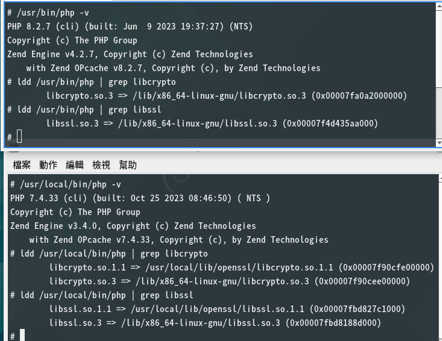
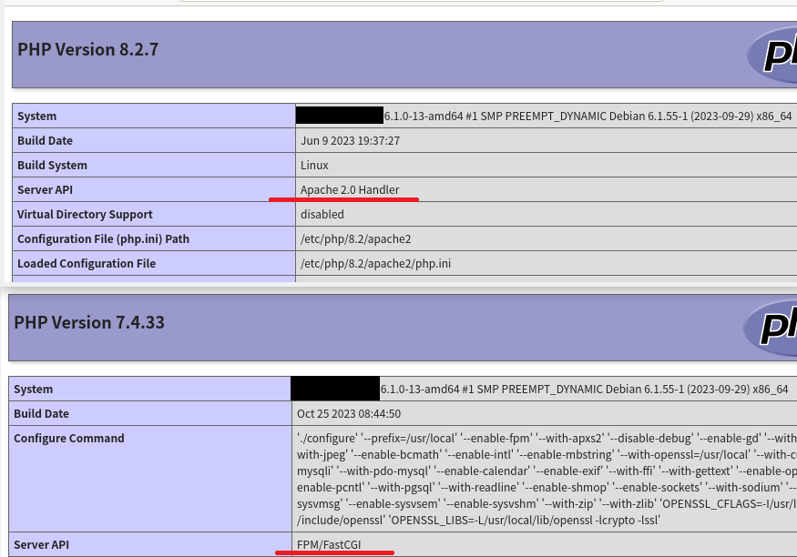

Debian 12 安裝 PHP 7.4
======================

Debian 12 已經移除 PHP 7.4 套件，只留 PHP 8.2 套件。
不幸的是，有些 PHP 程式還沒有升級到 PHP 8.2。
為了這些舊程式，我編譯打包了 php7.4-compat 套件。

下載 [php7.4-compat_7.4.33_amd64.deb](https://drive.google.com/file/d/1Pre4c53yRJ-D9IMerX4HQMkGL96qtVr4/view?usp=sharing)。這個下載點大概放到2024年12月吧。

為了執行舊 PHP 程式，使用 docker 跑 Debian 11 容器也是可行的解決方案。
只是容器內的 PHP 7.4 參照的動態連結函式庫是 Debian 11 的套件版，也就是版本較舊。

而自行編譯的方式， PHP 7.4 參照的函式庫會是 Debian 12 的套件版。
由於編譯依賴的套件相同，此法的 PHP 7.4 將和 PHP 8.2 共用相同的動態連結函式庫，是新的版本。
只是 PHP 7.4 的程式碼本身還在用 OpenSSL 1.1.1，所以多連結一個 libssl1.1。

第1步、安裝源碼編譯工具
-------------------

```term
sudo apt-get install build-essential
sudo apt-get install libreadline-dev
sudo apt-get build-dep php8.2-fpm
```

apt-get 參數 *build-dep* 會安裝建置指定套件時需要的所有套件。
能編譯 PHP 8.2 的組態環境，自然也能編譯 PHP 7.4。
所以我指定 `build-dep php8.2-fpm` 安裝編譯 PHP 8.2 的組態環境。
套用這個環境編譯 PHP 7.4。

第2步、安裝 libssl1.1
--------------------

PHP 依賴的 OpenSSL 在 Debian 12 升級了，從 OpenSSL 1.1.1 (libssl1.1) 升級到 OpenSSL 3.0 (libssl3)。
但 PHP 7.4 的源碼不支援 OpenSSL 3.0，所以不能用。

所幸 Debian 11 的 OpenSSL 1.1.1 套件 (libssl1.1) 在 Debian 12 還能用，不必重新編譯。
但不要直接安裝套件 libssl1.1，以免和 libssl3 打架。

下載 Debian 11 的 OpenSSL 1.1.1 套件，然後手動解開 .deb 內容。
再把解出的檔案複製到 /usr/local 的相對位置上。
連結 OpenSSL 1.1.1 需要的標頭檔放在 /usr/local/include/openssl，
而動態連結庫放在 /usr/local/lib/openssl。

這段動作，我寫在 [install-libssl1.1.sh](install-libssl1.1.sh)。

交給編譯器和連結器的參數分別是:

* C compiler flag: `-I/usr/local/include/openssl`
* ld flag: `-L/usr/local/lib/openssl -lcrypto -lssl`

如果到 Debian 13 還需要跑 PHP 7.4，這時或許就要重新編譯 OpenSSL 1.1 了。

第3步、下載 PHP7.4 源碼
-------------------

從 Debian repo 下載 PHP 7.4 源碼。或直接從 PHP 官網下載。

```term
wget http://deb.debian.org/debian/pool/main/p/php7.4/php7.4_7.4.33.orig.tar.xz
```

解開源碼壓縮檔。解出的源碼目錄應該會是 php-7.4.33。

第4步、configure; make; make install
---------------------------------

進入 PHP 7.4 源碼目錄，先使用 `./configure` 工具組態編譯項目。
最主要的是 *openssl* 項目加上第 2 步說的編譯參數。
指令內容如下:

```term
OPENSSL_CFLAGS=-I/usr/local/include/openssl
OPENSSL_LIBS=-L/usr/local/lib/openssl -lcrypto -lssl

./configure --prefix=/usr/local --enable-fpm \
    --with-openssl=/usr/local \
    --disable-debug
```

上面這個組態只會編譯最基本的 PHP 功能。
需要其他 extension 的，別忘了加上。

我的編譯組態寫在 [my-configure.sh](my-configure.sh)。

configure 會一併檢查編譯依賴的函式庫是否可用。
若無缺漏錯誤，接下來你就執行 make; make install。

```term
make
sudo make install
```

此編譯過程產出的 PHP 7.4 依賴的 lib 版本都會和 Debian 12 的 PHP 8.2 一樣。
除了 OpenSSL 是 1.1.1。

第5步、打包.deb
---------------

上一步的 `make install` 把 PHP 7.4 的檔案都複製到 /usr/local 的相應位置了。
最後就是把它們抓出來打包成 .deb 檔案。

這個工作用了我寫的工具 [make-package](https://github.com/shirock/rocksources/tree/master/linux/make-package)。
打包工作需要的資料檔案，含 make-package 工具，我都放在目錄 [package-files](package-files)。下載[package-files.zip](package-files.zip)。

進入這個目錄後，執行下列的指令:

```term
$ python3 make-package --head=PKG-README dist

dpkg-deb: building package 'php7.4-compt' in 'dist/php7.4-compat_7.4.33_amd64.deb'.
```

我的工具就會把分散在 /usr/local 各目錄的 PHP 7.4 相關檔案都收集起來，建立 php7.4-compat 套件 (放在 dist 子目錄)。

附錄、和 PHP8.2 共存
---------------



從 ldd 的資訊可以看到，PHP 7.4 同時連結了 OpenSSL 1.1 和 OpenSSL 3。這不是錯誤，也不會搞混。

因為 PHP 7.4 參照的函式庫，有些本身也需要呼叫 OpenSSL。
而它們在 Debian 12 的編譯組態是連結 OpenSSL 3。

PHP 7.4 直接參照的是 OpenSSL 1.1 函式庫。
PHP 7.4 參照的其他函式庫再參照的則是 OpenSSL 3 函式庫。
各取所需，不相干的。



如果想在 Apache2 下共存兩種版本的 PHP，只有一個能選擇用 apache module，其他必須走 FPM。圖中選擇的是 PHP 8.2 走 apche module，而 PHP 7.4 走 FPM。

然後選擇用 virtual host 區隔網站程式使用的 PHP 版本環境。例如 virtual host:80 跑 PHP 8.2，而 virtual host:1080 跑 PHP 7.4。

如果不同版本的 PHP 都選擇用 FPM 模式，那設定彈性更大。
Apache2 可以用複雜的 *FilesMatch* 規則指示哪個網站程式要叫哪個 PHP。
nginx 設定也是同理。

附錄、從 repo 取得源碼
----------------

若不想用 wget 下載源碼，也可透過 apt-get 從 Debian  repo 取得。

首先 在 source.list 中，加入 bullseye 來源。
再用 apt-get 的 *source* 參數指定版本。

```term
ap-get update
apt-get source php-fpm=7.4
```
