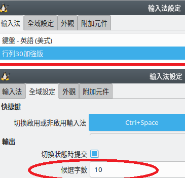

# FCITX 行列30加強版 (fcitx-array30plus)

加強版就是添加一、二級簡碼和 w 特殊符號組。

fcitx-table-array30 所採用的字根表中，包含行列30特別碼以及1996年新增特別碼。但不含一、二級簡碼和 w 特殊符號。

一級簡碼的使用率實在很高，沒它很難用。所以我將以前設計 [TouchIME](https://rocksaying.github.io/archives/25452026.html) 時整理的行列30簡碼表拿出來，與 fcitx-table-array30 的字根合併。
**All the data files are in public domain.**

但受到 fcitx 碼表輸入法的規則限制，有些二級簡碼需要特別處理，故和行列30標準仍有差異。
**作法請看本文後半的「二級簡碼合併規則說明」。**
我在處理二級簡碼過程中，發現來源的 array30.txt 中有[錯誤編碼](錯誤編碼.md)，已刪除那些錯誤。

合併一級簡碼結果 31751 組。加入二級簡碼結果 38831 組。

因為二級簡碼和特別碼重複衝突的狀況不可避免，我決定以特別碼為優先。所以合併進來的二級簡碼不保證每個字的位置都符合規定。

合併結果中，有九成以上的二級簡碼字，會出現在候選字清單的正確位置上。不到一成的重複字，位置有所挪動。

至於 fcitx5 ，在我的系統中 (Debian KDE) 始終不能穩定工作。我無法測試它的碼表輸出結果，不考慮繼續。
後續或許會改用[「中州韻」的行列30方案](https://github.com/rime/rime-array)。

## 字根表來源

* [array30.txt 取自 fcitx-table-extra](https://github.com/fcitx/fcitx-table-extra/tree/master/tables)。來源有錯誤編碼，我這兒的 array30.txt 已經刪掉那些字了。
* [行列30簡碼表 ar30_hw.txt ，取自 TouchIME](https://github.com/shirock/rocksources/tree/master/web/touch-ime/array30)
* [行列小站](http://www.array30.com/)
* [w符號](https://louis3c.blogspot.com/2018/01/ubuntufcitx.html)

## 下載與安裝

Debian/Ubuntu 系統必須先安裝 fcitx-table 套件: apt-get install fcitx-table

FCITX 行列30加強版資源:

* [array30plus_v2.zip](array30plus_v2.zip): 含一級簡碼與二級簡碼的碼表檔 (建議下載)。
* [array30plus_v1.zip](array30plus_v1.zip): 只含一級簡碼的碼表檔。
* [fcitx-table-array30-icons.zip](fcitx-table-array30-icons.zip): icon 圖示。

碼表檔在家目錄解開。 icon 圖示在系統根目錄解開。

```shell

$ unzip array30plus_v2.zip -d ~
$ sudo unzip fcitx-table-array30-icons.zip -d /

```

重新啟動輸入法後，fcitx 輸入法設定畫面應該就能看到「行列30加強版」項目了。還有「全域設定」的「候選字數」要改成 10 。



Debian/Ubuntu 搜索碼表文件的順序是:

1. 先找使用者家目錄下 ~/.config/fcitx/table
2. 再找系統安裝目錄 /usr/share/fcitx/table

## 合併程式操作說明

合併程式：[https://github.com/shirock/rocksources/tree/master/linux/fcitx-table-array30plus](https://github.com/shirock/rocksources/tree/master/linux/fcitx-table-array30plus)。

修改 merge.py 的 `MIX_LV2_CODE` 這一行。 *False* 為取消二級簡碼， *True* 則合併二級簡碼。

~~~python

# 只合併一級簡碼
MIX_LV2_CODE = False

# 合併二級簡碼
MIX_LV2_CODE = True

~~~

先執行 merge.py 將簡碼表和字根表合併，產生 array30plus.txt 。
再執行 fcitx-tools 的 txt2mb 轉換字根表。

fcitx4碼表格式請參考: [fcitx handbook - 5.3. 码表输入法](http://fcitx.github.io/handbook/sect1-code-table.html#id464632)。

使用方式，參考 [在Linux Mint上安裝自家輸入法，從cin格式轉到fcitx的mb碼表](https://blog.fat-nerds.com/dot-nerd/linux-mint-fcitx-chinese-customized-input-table-cin-mb/) 。我將轉換後的字根表放在 ~/.config/fcitx/table/ 。順便移除了 fcitx-table-array30 套件。

```shell

$ mkdir ~/.config/fcitx/table
$ cp array30plus.conf ~/.config/fcitx/table/
$ cp array30plus.mb ~/.config/fcitx/table/

```

## 不使用二級簡碼的原因

為什麼我要加上一個不使用二級簡碼的選項？

1. 因為二級簡碼收錄的字都有特別碼，重複了。
2. 二級簡碼會把沒用到的位置用 '□' 佔位。
不幸的是， fcitx 轉換字根表時，會將同碼的重複字清除(包含'□')，也就不能保證這些字在候選字清單的順序，破壞了二級簡碼規則。

二級簡碼是兩個字根再加數字鍵選字。而特別碼是兩個字根再加空白鍵(轉換鍵)。
在輸入效率上，特別碼比較理想，所以有些使用者並不使用二級簡碼。

## 捨棄一級簡碼的'隨'

一級簡碼的'隨'和 特別碼'的'的位置重複了。取'的'捨'隨'。

在行列30的官方輸入規則中，特別碼不出現在候選字清單，而是按下空白鍵(轉換鍵))直接出字。
但 fctix 碼表輸入法的規則做不到這一點。

fcitx 碼表輸入法的預設出字規則是按下轉換鍵後，出第一個候選字。
按這個規則，'的'特別碼剛好和'隨'的一級簡碼佔了同一個候選字位置，都是 T 加空白鍵。

基本上，每個一級簡碼的第一個候選字都剛好是單字根字。唯有'隨'字例外。
作為踢出一級簡碼位置的補償，我把'隨'加到它首二碼的候選字清單。

## 二級簡碼合併規則說明

1. 若一字同時有特別碼與二級簡碼，則從二級簡碼清單中刪掉。以特別碼優先。
2. 特別碼和一級簡碼，優於二級簡碼。重覆位置的二級簡碼字往後挪。因此有些字並沒有出現在行列30標準位置上。
3. 二級簡碼佔位符號'□'，從前二碼符合字中取出置換。
4. 若字數不足，則以數字符號 '⑤', '⑥' 等代替佔位。

舉 'tz', 'uj', 'z,' 三字根組合說明。

### *tz*

* 特別碼: '團'
* 二級簡碼: '墮', '□', '□', '□', '阪', '□', '□', '陜', '□', '□'
* 自訂補充: '墮', '□', '□', '□', '阪', '隨', '□', '陜', '□', '□'
* 前二碼符合字: '䧀', '䧥', '陏', '陕', '阫', ...

'隨' 字本為一級簡碼，但和特別碼'的'衝突。
因為二級簡碼的第6位置是空的，符合'隨'的尾碼(n:6下)，所以我把它放到二級簡碼第6位置。

若是不合併二級簡碼的情形，'隨'字將成為tz的第二候選字。

特別碼優於二級簡碼，重覆位置的二級簡碼字往後挪。
故'墮'從第一位置挪到第二位置。

合併中途: '團', '墮', '□', '□','阪', '隨', '□', '陜', '□', '□'

二級簡碼佔位符號'□'，從前二碼符合字中取出置換。

合併結果: '團', '墮', '䧀', '䧥', '阪', '隨', '陏', '陜', '陕', '阫'

### *uj*

* 特別碼: '卻'
* 二級簡碼: '膽', '□', '□', '腆', '服', '□', '□', '□', '□', '□'
* 前二碼符合字: '胴', '胦', '䏙', '䏹', '䏥', '肕', ...

特別碼優於二級簡碼，重覆位置的二級簡碼字往後挪。
故'膽'從第一位置挪到第二位置。

合併中途: '卻', '膽', '□', '腆', '服', '□', '□', '□', '□', '□'

二級簡碼佔位符號'□'，從前二碼符合字中取出置換。

合併結果: '卻', '膽', '胴', '腆', '服', '胦', '䏙', '䏹', '䏥', '肕'

### *z,*

* 完全符合字: '灰'
* 二級簡碼: '灰', '□', '□', '□', '□', '□', '盔', '□', '□', '□'
* 前二碼符合字: '㶨', '㶪', '㓹'

完全符合字和二級簡碼內容重覆，不變。

合併中途: '灰', '□', '□', '□', '□', '□', '盔', '□', '□', '□'

二級簡碼佔位符號'□'，從前二碼符合字中取出置換。
若字數不足，則以數字符號代替佔位。

合併結果: '灰', '㶨', '㶪', '㓹', '⑤', '⑥', '盔'
